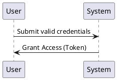

# Design as Data

Design as Data is a conceptual utility/tool that turns design artifacts into structured data and back again. The project initially focuses on sequence diagrams written in PlantUML, with plans to support OpenAPI and AsyncAPI in the future. Currently, it converts UML sequence diagrams into CSV rows that represent message flows, then reconstructs UML sequence diagrams from that data.

The repository supports a simple "design as data" workflow:

- A PlantUML sequence diagram can be parsed into CSV records.
- CSV data can be converted back into a PlantUML sequence diagram.
- The conversion is intended for tracing communication flows between participants.

This makes the project useful for design documentation, transformation pipelines, or any process where a visual workflow needs to be represented as data for further processing.

## Project overview

The project consists of a small set of JavaScript modules that handle:

1. Extracting message data from a PlantUML design file
2. Writing that data into a CSV file
3. Analyze and transform extracted data ( manual )
4. Reading transformed CSV message data
4. Rebuilding a PlantUML sequence diagram from the CSV content

The typical flow is:

- `design/in/*.puml` → `extractor.js` → `data/out/*.csv`
- `data/in/*.csv` → `generator.js` → `design/out/*.puml`

## Repository structure

- `README.md` — project documentation
- `index.js` — entry point that runs the extractor and generator scripts against example files
- `extractor.js` — converts PlantUML message lines into CSV content
- `generator.js` — converts CSV message data into PlantUML content
- `design/` — sample PlantUML input/output directories
- `data/` — sample CSV input/output directories
- `LICENSE` — project license

## File-by-file summary

### `index.js`

This file is the execution entry point for the project. It reads sample files from the input folders, processes them through the extractor and generator, and writes the results to the corresponding output directories.

Key responsibilities:

- Reads PlantUML files from `./design/in`
- Calls `extractor.extractData()` for each input file
- Writes generated CSV files into `./data/out`
- Reads CSV files from `./data/in`
- Calls `generator.generateDesign()` for each CSV file
- Writes generated PlantUML files into `./design/out`

This script is designed to demonstrate the end-to-end translation workflow using bundled sample files.

### `extractor.js`

This module converts a PlantUML sequence diagram into a CSV string. It is responsible for scanning each line of the UML content, matching message lines, and turning them into structured records.

Methods:

- `extractData(design)`
  - Entry point for extraction.
  - Calls `parsePuml()` and then `convertJsonToCsv()`.

- `parsePuml(content)`
  - Splits the source text into lines.
  - Uses a regex to match message lines in the form:
    - `Sender -> Receiver: Message`
  - Extracts sender, arrow, receiver, and message payload.
  - Returns an array of objects containing these values.

- `convertJsonToCsv(data)`
  - Maps each parsed row into a CSV line using the format:
    - `sender,arrow,receiver,message`
  - Joins all rows into a single newline-delimited CSV string.

- `log(message)`
  - Internal debug helper; currently disabled.

### `generator.js`

This module converts CSV message data back into a PlantUML sequence diagram. It takes raw CSV content, transforms it into a JSON-like row structure, and builds a valid UML diagram string.

Methods:

- `generateDesign(data)`
  - Entry point for generation.
  - Calls `convertCsvToJson()` and `generatePuml()`.

- `convertCsvToJson(csvContent)`
  - Splits the CSV string by line.
  - Parses each line into four fields: sender, arrow, receiver, message.
  - Produces an array of message objects.

- `generatePuml(data)`
  - Creates the PlantUML document.
  - Writes the `@startuml` and `@enduml` wrappers.
  - Appends each message in the format:
    - `Sender Arrow Receiver : Message`

### `design/`

This folder contains design examples, including sequence diagram files used as input for extraction and output generated from CSV data.

- `design/in/seq1.puml` contains an example PlantUML sequence diagram
- `design/out/` is the destination for generated sequence diagrams

### `data/`

This folder stores the CSV representation of the sequence diagrams.

- `data/in/seq1.csv` is an input example for generation
- `data/out/` stores CSV output produced by the extractor

## Example workflow

### PlantUML to CSV

Input example:

```puml
User -> System: Submit valid credentials
System -> User: Grant Access (Token)
```

Output CSV:

```csv
User,->,System,Submit valid credentials
System,->,User,Grant Access (Token)
```

### CSV to PlantUML

Input CSV:

```csv
User,->,System,Submit valid credentials
System,->,User,Grant Access (Token)
```

Output PlantUML:



## Notes

- The project is intentionally simple and focused on message-based sequence diagrams.
- It supports a narrow subset of PlantUML syntax and expects message lines in a straightforward format.
- The code is written in plain JavaScript and does not require a framework or external dependencies.

## Typical use

Use this project when you want to:

- convert design artifacts into machine-readable data
- exchange message flow definitions as CSV
- generate or regenerate diagrams from structured records
- prototype a minimal design-as-data workflow

This README intentionally documents both the conceptual purpose and the implementation structure so the repository is easier to understand and extend.